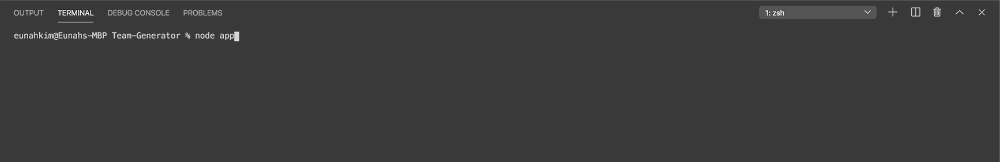

# Team-Generator

## Description
This application is a template generator command line application to build a software engineering team that passes all unit tests. The application will prompt the user for information about the team manager and then information about the team members. The user can input any number of team members, and they may be a mix of engineers and interns. When the user has completed building the team, the application will create an HTML file that displays a nicely formatted team roster.

## User Story
```
As a manager
I want to generate a webpage that displays my team's basic info
so that I have quick access to emails and GitHub profiles
```

## Table of Contents
* [Installation](#installation)
* [Usage](#usage)
* [Tests](#tests)
* [Questions](#questions)

## Installation
```
npm i
```

## Usage
Run the APP.JS file using NODE from your command line and fill in your team  manager's detail according to the prompts provided:



After entering your manager's information, you will be prompted to add an engineer or intern to your team:


You can continue to keep adding employees to your team until you're finished building your team:


When finished, a TEAM.HTML page will be created in an Output folder that will display your team and their information:


## Tests
```
npm test
```

## Questions
If you have any questions about the repo, open an issue or contact [Eunahk92](https://github.com/eunahk92) directly at Eunahkim92@gmail.com.